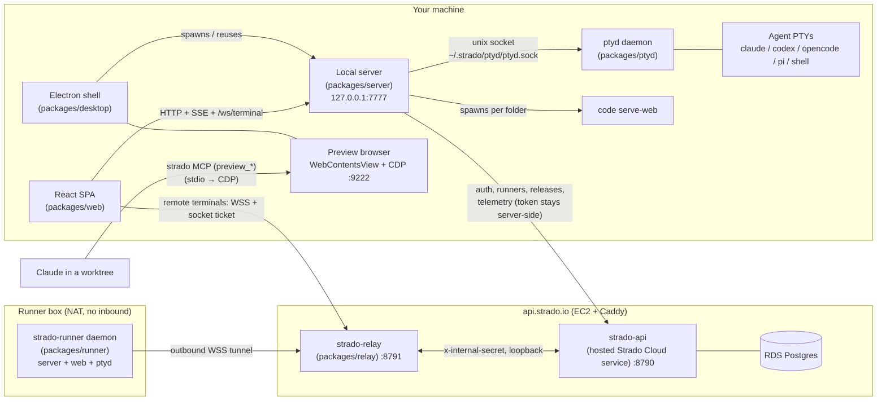
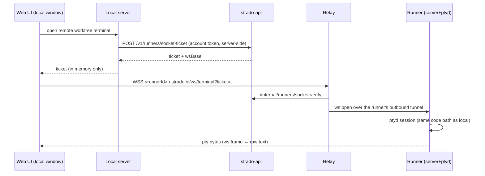
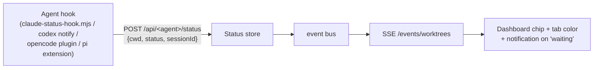

# Strado — Architecture & Features

> Version 0.1.23 · npm workspace · TypeScript/ESM throughout.
> Strado is **one place to run all your coding agents** across many parallel git
> worktrees: agents, terminals, an embedded editor and browser, git/PR review, Jira, and
> honest time tracking — in one window. Everything runs on your machine; the only things
> that leave localhost are the integrations you configure (Jira, GitLab/GitHub, the
> Strado cloud API for sign-in/updates/runners).

---

## 1. The system in one paragraph

A Fastify server (`packages/server`) binds **loopback only** and owns all state, git
operations, dev-server processes and terminal sessions. A React SPA (`packages/web`) is
the UI, served by that server (or by Vite in dev). An Electron shell
(`packages/desktop`) spawns-or-reuses the server as a plain Node child and adds the
surfaces a browser can't provide: a WebContentsView preview browser with CDP (which is
what lets agents *see and click* the app they're building), embedded VS Code, native
hotkeys, and self-update. PTYs live outside all of it in a standalone daemon
(`packages/ptyd`) reached over a Unix socket — which is why agent sessions survive
server restarts and app upgrades. Remote execution is a reverse tunnel: a headless
`packages/runner` (server + web + ptyd, no Electron) dials out to `packages/relay` on
the cloud box, and the desktop reaches it through relay-issued tickets.
`strado-api` (the hosted Strado Cloud service) provides accounts, invite gate, runner
registry, and release feed, and **never ships inside the app**.

## 2. Topology



Key boundaries:

- **The server never listens beyond `127.0.0.1`.** Remote access exists only through
  the outbound tunnel; nothing inbound is ever opened on a runner.
- **The renderer never sees cloud tokens.** Every runner/cloud call goes through the
  local server; the one exception is short-lived socket tickets (in memory only).
- **`strado-api` is deploy-only.** Type imports flow *into* it, never out.

## 3. Feature inventory (what the user gets)

| Feature | What it does | Where it lives |
|---|---|---|
| **Worktree dashboard** | Create / adopt / delete worktrees across repos and workspaces; each row shows branch, uncommitted changes, env profile, dev-server status, agent status, tracked time — live via SSE. | `web/pages/Dashboard.tsx`, `server/routes/worktrees.ts` |
| **Agent & terminal hub** | Persistent Claude Code / Codex / OpenCode / Pi / shell sessions per worktree; multiple Claude sessions (`Claude N` tabs); sessions survive tab close, server restart and app upgrade. Split panes, drag-reorder tabs, hold-Cmd Arc-style switcher with live previews. | `web/pages/TerminalView.tsx`, `server/routes/terminal.ts`, `packages/ptyd` |
| **Agent handoff** | Continue a task in a fresh provider session when the current agent reaches a limit; Claude, Codex, OpenCode and Pi are each usable as source and target. Maps each Strado tab to its provider conversation, extracts clean user/assistant messages, and persists them with authoritative Git state. Rendered terminal output is never used as conversation context. | `web/components/HandoffDialog.tsx`, `server/routes/handoffs.ts`, `server/services/agentConversation.ts`, `server/services/handoffStore.ts` |
| **Embedded VS Code** | `code serve-web` per folder in a cross-origin iframe, kept mounted across tab switches; Cmd+W reaches the editor (Close Window is Shift+Cmd+W). | `server/services/vscodeWeb.ts`, desktop hotkey wiring |
| **Preview browser + agent verification** | Multi-tab in-app browser (WebContentsView) with toolbar and dockable DevTools. Exposed to agents as the `preview_*` tools of the `strado` MCP server (screenshot, click, fill, eval, console, network) — scoped so each session only sees **its own worktree's** tabs. | `desktop/main.cjs`, `server/hooks/mcp/preview.mjs`, `server/routes/previewTargets.ts` |
| **Diff & commit** | Staged/unstaged hunks, per-hunk stage/discard, commit, push/pull, branch diff, commit graph, in-app MR/PR review and creation. | `web/pages/DiffView.tsx`, `server/routes/gitChanges.ts` |
| **Git providers** | GitLab and GitHub PRs behind one provider-agnostic `MergeRequest` shape; per-owner tokens (`host/owner` keys); ssh alias resolution via `ssh -G`. | `server/services/{gitlab,github,gitProviders}.ts` |
| **Jira, live** | Ticket badges tinted by real Jira status, transitions from the board, sprint-scoped pickers, one-click sprint import that scaffolds worktrees from tickets, hover cards. Credentials stay server-side (mode 600); the server proxies all Jira calls. | `server/routes/jira.ts`, `web/components/Sprint*`, `Jira*` |
| **Time tracking** | Hands-on time per worktree from real signals (keystrokes, agent turns, file saves, focus), sessionized with a 15-min idle gap. No timers to start. | `server/services/activity{Tracker,Watcher}.ts` |
| **Agent status everywhere** | Hooks in each agent POST status → per-session and aggregate chips in the dashboard and tab strip (amber working / blue waiting / idle), desktop notifications + beep on "waiting". | `server/hooks/*-hook.mjs`, `services/claudeHooks.ts` |
| **Runners (remote worktrees)** | Pair a Linux box with one command; its worktrees appear **in the same sidebar**, `+` offers "This Mac / runner". Remote terminals, git, diffs work in the local window; remote dev servers reachable at `localhost:<port>` via port forwarding. | `packages/runner`, `packages/relay`, `server/routes/runners.ts` |
| **Workspaces** | Named repo groups with their own defaults (editor, port base, worktree root), each with isolated state on disk. | `server/services/workspaceConfig.ts`, `web/pages/WorkspacesPage.tsx` |
| **Accounts & invite gate** | Device-code sign-in (email magic link, Google, GitHub) against strado-api; packaged builds gate the whole API (including the terminal socket) behind a license with a 7-day offline grace. | `server/routes/{auth,license}.ts`, `cloud/src/auth/*` |
| **Self-update** | Hand-rolled (unsigned builds): sha256-verified DMG swap on macOS, atomic AppImage rename on Linux; runner self-updates independently and rewrites its own systemd unit. | `desktop/main.cjs`, `runner/src/selfUpdate.ts` |
| **Knowledge base** | Markdown browser per worktree (`kb` tabs). | `server/routes/knowledgeBase.ts`, `web/components/KnowledgeBasePanel.tsx` |
| **Dev/stable segregation** | `STRADO_PROFILE` splits state (`~/.strado` vs `~/.strado-dev`), ports (7777/7877), CDP (9222/9322) and Electron app identity, so an installed Strado and a repo build run side by side. | `server/src/profile.ts`, `desktop/profile.cjs` (parity pinned by test) |

## 4. Packages

### 4.1 `packages/server` — the state owner

Fastify 4 + zod. Entry `src/index.ts` resolves the **profile** and applies env before
any other import, then builds the dependency graph (`workspaces`, `registry`, event
`bus`, `jobs`, `git`, `terminal`, agent status stores, `activity`, …) decorated as
`app.deps`, serves the web dist with an SPA fallback, and reaps orphan processes.

**API surface (abridged):**

- Root: `/api/health`, `/api/capabilities`, `/api/workspaces*`, `/api/runners*`,
  `/api/terminal/peek`, `WS /ws/terminal`, `/api/{claude,codex,opencode,pi}/status`,
  `/api/activity/beat`, `/api/vscode`, `/api/jira/*`, `/api/{gitlab,github}/config`,
  `/api/license*`, `/api/auth/{start,poll,signout}`, `/api/update-check`,
  `/api/preview-targets`, `/api/feedback`, `/api/profile`, `/api/env-check`.
- Workspace-scoped (`/api/w/:wsId/…`, `preHandler` resolves the workspace): `repos*`,
  `worktrees*` (create/delete are **202 + jobId**, progress over SSE), `git/*`
  (changes, diff, log, stage/discard down to hunk granularity, push/pull, commit),
  `merge-requests*`, `kb/*`, `link|unlink|relink` (node_modules), `start|stop|status|logs`
  (managed dev servers), `sprints*`, `open-editor`, `open-terminal`.
- **Events are SSE, not WebSocket** — five channels (`/events/worktrees`, `workspaces`,
  `sprints`, `logs/:path`, `jobs/:id`), 15s heartbeats. WebSocket is used for exactly
  one thing: the terminal.

**Terminal protocol** (`/ws/terminal?ws&path&mode&session&cols&rows`): client sends
JSON `{type:'data'|'resize'}`; the server replies with **raw pty bytes, no envelope**.
Session 1 resumes the agent conversation; sessions ≥ 2 start fresh. Session keys are
`<worktreePath>` + `\0` + mode suffix; session 1 keeps the historical bare-key shape so
multi-session needed no migration.

**Licensing:** `requireLicense` runs before every route when `STRADO_LICENSE_REQUIRED=1`
(packaged builds). It gates `/api/`, `/events/` **and `/ws/`** — the terminal socket is
a live shell and would otherwise be the biggest hole. The open-path list is exact,
never prefix-matched.

**Activity watcher platform split:** darwin uses `fs.watch(recursive:true)` (one
FSEvents stream per worktree); Linux uses chokidar with serialized per-worktree scans to
stay under inotify limits. (Chokidar on macOS froze the dashboard ~40s on real repos.)

**State on disk:**

```
~/.strado (stable) | ~/.strado-dev (dev)
├── license.json / jira.json / gitlab.json / github.json   (0600)
├── profile.json          # fullName, callMe, telemetry opt-out
├── activity.json         # tracked seconds per worktree
├── agent-sessions.json   # Strado tab → provider conversation id lookup
├── logs/
├── worktrees/<repoId>/   # default worktree root
└── ptyd/                 # ptyd.sock, bin/, manifest, log

config/ (stable: <cwd>/config, dev: <home>/config)
├── workspaces.json
└── workspaces/<wsId>/    # repos.json, state.json, sprints.json, handoffs.json, .backups/
```

All stores share one design: serialized write queue, reads never write back,
backup→tmp→rename writes, corrupt-but-present files are copied aside and **throw**
rather than being treated as empty. Rotating backups (1 per 5 min, keep 10).

### 4.2 `packages/web` — the SPA

React 18 + Vite + Tailwind + xterm. **No router, no state library** — navigation is
nested state. `LicenseGate` wraps everything; then `Dashboard` (sidebar + Active/Sprints
board, fed by SSE + a 15s re-sync poll), `TerminalView` (the hub, rendered inline so
switching worktrees remounts it), `DiffView` (full-screen overlay), settings and
workspace modals.

The hub's tab modes: `shell` / `claude` / `codex` / `opencode` / `pi` (pty over WS), `vscode`
(iframe, kept mounted-but-hidden), `browser` (Electron WebContentsView overlay,
multi-tab, DevTools dock bottom/right/window), `kb`. Tab icon = identity, tab **color =
status**. Drag-reorder is pointer-based with DOM transforms (HTML5 DnD rejected).
Active tab restore never silently spawns an agent.

Electron is detected by `!!window.strado` (never the user agent — the shell presents a
plain-Chrome UA so OAuth providers accept sign-in inside previews). The preload bridge
exposes exactly 14 members: previews, devtools, hotkeys, update, `pickDirectory`,
`openRunner` — no fs, no raw ipcRenderer.

**Remote worktrees in the UI:** remote rows nest under the local repo matched by
normalized clone URL ("Only on runners" section otherwise). A remote hub is keyed
`${runnerId}:${path}`, polls via runner RPC instead of SSE, connects terminals straight
to the relay, and **hides** (not disables) the VS Code/Browser tabs based on
`/api/capabilities` — closing a remote tab detaches rather than kills.

### 4.3 `packages/desktop` — the Electron shell

One main `BrowserWindow` + preload bridge; a second sandboxed window (no preload) for
runner dashboards. Previews and docked DevTools are `WebContentsView`s — explicitly
**not** `<webview>`, because Chromium drops CDP-injected input for webview guests
(agents could read but not click).

- **Embed bounds protocol:** the renderer pushes placeholder-div bounds via
  ResizeObserver + a 500ms interval; hiding = park offscreen (detaching drops the
  compositor surface and views come back blank); a 2s heartbeat self-heals.
- **Server startup:** probe `/api/health`, reuse an external server, else spawn the
  server as a **plain Node child** (never inside Electron — keeps node-pty on the
  system Node ABI). Packaged env includes a login-shell-resolved `PATH` so a
  Finder-launched app can find `claude`/`codex`/`code`.
- **CDP:** `remote-debugging-port` from the profile (9222/9322). Each preview tab is
  registered (`targetId`, `cdpPort`, worktree `path`) in the server's
  `/api/preview-targets` registry.
- **`strado` MCP server** (`packages/server/hooks/strado-mcp.mjs`, bundled to `bin/strado-mcp.cjs`; `bin/preview-mcp.cjs` is a one-release shim): dependency-free stdio MCP with the ten `preview_*` tools (tabs/status/screenshot/eval/console/network/click/fill/navigate/reload, filtered by `STRADO_WORKTREE` so an agent only touches its own worktree's tabs; not available inside a sandbox) and the fourteen intercom tools — `intercom_send`, `intercom_peers`, `intercom_inbox`, `intercom_diary`, `run_in_shell`, `read_tab`, plus step 8's `task_create`, `task_list`, `task_claim`, `task_done`, `task_release`, `intercom_escalate`, `intercom_ask`, and step 9's `intercom_fork` — authenticated by the tab's `STRADO_AGENT_TOKEN` over the loopback port or the sandbox socket (24 tools in all). Strado registers it for Claude per worktree in `~/.claude.json` (project-local scope) when a Claude or shell tab opens, and removes its old global `strado-preview` entry — automatic; the entry it writes is `projects[<worktree>].mcpServers.strado = { type: 'stdio', command: 'node', args: ['<hooks>/strado-mcp.mjs'] }`. Codex is registered per launch instead (2026-09-08): every Codex tab starts with `-c 'mcp_servers.strado.command="node"' -c 'mcp_servers.strado.args=["<hooks>/strado-mcp.mjs"]' -c 'mcp_servers.strado.env_vars=["STRADO_AGENT_TOKEN","STRADO_AGENT_ID","STRADO_SCOPE_ID","STRADO_STATUS_PORT","STRADO_SERVER_SOCKET","STRADO_SERVER","STRADO_WORKTREE"]'` next to its `notify` override (`codexConfigFlags` in `services/agentSpawn.ts`), because Codex spawns stdio MCP servers with a minimal environment allowlist rather than the tab's environment — without `env_vars` the bridge has no token and every intercom tool answers "this is not a Strado tab". A hand-written `[mcp_servers.strado]` in `~/.codex/config.toml` is no longer needed; one that exists must carry the same `env_vars` line to work. The remaining harnesses need a manual, once-per-install registration: OpenCode, in `opencode.json`, `"mcp": { "strado": { "type": "local", "command": ["node", "<app>/Resources/bin/strado-mcp.cjs"] } }`; Pi, in Pi's MCP config, `{ "mcpServers": { "strado": { "command": "node", "args": ["<app>/Resources/bin/strado-mcp.cjs"] } } }`. Tool names changed from `mcp__strado-preview__preview_*` to `mcp__strado__preview_*`.
- **Hotkeys:** `before-input-event` scoped to embeds — Cmd+←/→ tabs, Cmd+Alt+←/→
  groups, Cmd+K palette, Cmd+W close-tab (yielded to VS Code), Cmd+T new shell,
  Cmd+L Changes rail (Ctrl+L stays the shell's clear-screen). A tiny
  C helper (`cmdwatch.c`) polls `CGEventSourceFlagsState` because macOS never delivers
  the Meta keyup after a consumed Cmd chord — without it, hold-to-switch sticks open.
- **Self-update:** renderer polls every 15 min. macOS: DMG → sha256 → de-quarantine →
  staged copy → structural sanity check → `swap.sh` with rollback. Linux AppImage:
  download as a sibling file, verify, atomic rename over the running inode. `.deb`
  installs get link mode (root-owned). A global busy-latch serializes downloads.

### 4.4 `packages/ptyd` — the PTY daemon (why sessions survive)

Standalone daemon on a Unix socket (`0600` — the socket file *is* the auth boundary).
Binary framing: `[u32 total][u32 headerLen][JSON header][payload]`; pty bytes ride the
binary payload, never JSON. Per-session 256 KiB replay ring in memory. Flow control
pauses the pty at 1 MiB backlog (the kernel buffer throttles the writer at source).

**Sessions survive two different events, by two different mechanisms:**

1. **Server restart / app upgrade** — the daemon simply isn't the server's child. It's
   spawned detached, installed at a stable path (`~/.strado/ptyd/bin/`), and the new
   server re-adopts it via a `hello`/`hello-ack` probe and resubscribes with replay.
2. **Daemon upgrade** — fd handoff. The old daemon collects master fds *synchronously*
   (no `await` between collect and spawn — an exit callback could close an fd in the
   window), pauses sessions so pending bytes wait in the kernel, snapshots
   ids/dims/rings to a tmp file, and spawns the successor with the fds inherited.
   Failure at any point SIGKILLs the successor and resumes; sessions are never at risk.

```mermaid
sequenceDiagram
    participant S1 as old ptyd
    participant K as kernel pty buffers
    participant S2 as new ptyd
    participant Srv as strado server

    Srv->>S1: prepare-upgrade
    S1->>S1: pause sessions, collect master fds (sync)
    S1->>S2: spawn with fds inherited + snapshot file
    S2->>S1: upgrade-ack
    S1->>S1: release socket, exit
    S2->>K: adopt fds, resume reads (bytes preserved)
    Srv->>S2: hello → subscribe(replay)
    Note over Srv,S2: xterm reconnects; scrollback intact
```

### 4.5 `packages/relay` + `packages/runner` — remote execution

The relay (`strado-relay`, on the cloud box behind Caddy) routes by hostname:
`https://<runnerId>.r.strado.io` → that runner's tunnel. The runner **dials out**
(`wss://relay/tunnel?runner&token`); HTTP responses are streamed frame-by-frame so SSE
survives the tunnel; WS and raw TCP are multiplexed as `ws:*` / `tcp:*` frames. The
relay stores each channel's kind rather than inferring it (a hostile runner can't
answer a terminal's `ws:open` with `tcp:data` into an xterm). Close-code discipline:
`1008` = credential problem (re-mint), `1011` = runner away (back off) — never
conflated.

**Auth chain:** desktop mints a pair code via strado-api → human types
`strado-runner pair --code PAIR-XXXX-XXXX` on the box → exchanged for a long-lived
token (cloud stores its SHA-256). Browsers attach via single-use attach codes;
**terminal sockets use socket tickets** (multi-use, 30 min, by design — `SameSite=Lax`
kills cookies on cross-site WS handshakes, and single-use codes would mint-storm under
xterm's reconnect loop). The relay verifies everything against strado-api over
loopback with an internal secret; a cloud outage is *not* treated as a denial.

The runner daemon is the whole stack minus Electron: server (loopback only) + web dist
+ ptyd + in-process tunnel client + vendored Node and node-pty, versioned
**independently** of the desktop. It runs as a systemd `--user` unit with linger;
`KillMode=process` is load-bearing (the default SIGKILLs the whole cgroup, ptyd
included — which killed every agent session on restart). Its self-updater verifies
sha256 before unpacking, structurally checks the bundle, swaps a `current` symlink,
keeps one rollback generation, and **rewrites the unit** so unit-level fixes reach
existing installs.



**Port forwarding** (`localhost:<port>` to a dev server on the runner): the local
server spawns a separate `strado-forward` process (asset traffic must not run through
the server that enumerates worktrees), which binds `127.0.0.1:0` and opens **one relay
WS per TCP connection** (HTTP keep-alive survives). The runner gates ports to the union
of configured ranges, worktree ports and repo default ports — defense in depth, not a
privilege boundary. Measured ~170 ms/request through the tunnel vs 5 ms LAN.

**Worktree sandboxes** (when a container runtime is present): each newly created
worktree on a runner runs inside its own container, isolated from the host and other
worktrees; existing worktrees and all desktop worktrees remain unchanged. The bare repo
and worktree are bind-mounted at identical paths in and out (since `.git` is a pointer
file with absolute paths). ptyd stays on the host and execs into the container, so
terminal sessions survive daemon restarts and server upgrades; a container stop ends
live sessions and the next attach restarts it. Agent CLIs (`claude`, `codex`,
`opencode`, `pi`) live in a base image built locally from the repo's declared dependencies
(`.nvmrc`, `engines`). The user's credentials (model key, git identity) are injected
at container start via a 0600 env file — never baked into the image. Hook status
reaches the host over a bind-mounted socket allowlisted to status routes only. Sandboxes
park (stop) after 2h idle and resume on next attach.

**Operational notes:**
- A container carries the hooks-dir mount and credentials it was created with; changing those requires recreating the worktree, not just restarting.
- The hook socket allowlist pins the four status routes by prefix; a NEW route added under `/api/codex/`, `/api/opencode/` or `/api/pi/` would become reachable from inside sandboxes — add such routes deliberately.

### 4.6 `strado-api` — the hosted Strado Cloud service (deploy-only)

Fastify on `127.0.0.1:8790` behind Caddy. **Dual store:** Postgres when `DATABASE_URL`
is set, JSON files otherwise — the file mode *is* the rollback path, and one contract
suite exercises both. Refuses to boot if the migration head doesn't match.

- **Public:** `/v1/health`, `activate`, `heartbeat`, `events` (telemetry), `feedback`,
  `waitlist`, `/v1/release` (feed), `/v1/download/:file` (filename allowlist lives in
  the same module as the publisher so they can't disagree), `/install-runner.sh`.
- **Runners:** pair-code / pair / list / revoke / attach-code / socket-ticket, plus
  relay-only `/internal/runners/*` (shared secret, `timingSafeEqual`).
- **Auth:** device-code flow (`/v1/auth/device` → user approves in a browser →
  `/device/token`) plus a Better Auth **bridge that is an exact four-path allow-list**
  (magic-link verify, social sign-in, Google/GitHub callbacks). Everything else 404s.
  Ungated better-auth routes (its own magic-link sign-in, org writes) are deliberately
  removed — the invite gate stays access control.
- **Release feed stays a file in both modes** — it's how fixes ship; an RDS outage must
  never stop clients discovering the update that fixes it.
- Admin is a CLI on the box (`cli.js add|invite|release|migrate|…`); there is no HTTP
  admin surface. Publishing goes through `cli.js release` (server-side hash, allowlist,
  disk-space check) — never hand-edited `release.json`.

## 5. Cross-cutting flows

### Agent status (hook → chip)



Hooks are installed per worktree by the server (Claude: `.claude/settings.local.json`;
OpenCode: `.opencode/plugin/`) or passed on the launch command (Codex: `-c notify=…`;
Pi: `-e <hooks>/strado-pi-status.ts`, which keeps `.pi/` out of the worktree and
avoids pi's project-trust prompt). The Claude entry is a machine-independent constant
that runs `$STRADO_CLAUDE_HOOK` (set by `sessionEnv()`) and no-ops when it is unset or
missing — a path baked into the file outlives the worktree or install that wrote it and
fires `MODULE_NOT_FOUND` on every turn. Claude Code merges the main checkout's
`settings.local.json` into linked-worktree sessions, so installing into a worktree also
purges legacy path-baked Strado entries from the main checkout's file. They POST with ~1 s timeout, swallow errors, always exit 0 —
they must never block the agent. `sessionEnv()` injects `STRADO_SESSION_ID` per pty so
status is per-session, then **strips the instance-identity vars** (`STRADO_HOME`,
`PORT`, `STRADO_PROFILE`, …) so a Strado-inside-Strado session doesn't inherit the
outer instance's identity.

Every tab also gets an **agent identity** (`services/agentRegistry.ts`): a
derived id `<mode>-<tab>@<worktree-slug>` stable for the tab's life, an
**execution** minted at each PTY spawn with a random token, and an optional
per-workspace unique alias. `routes/terminal.ts` registers before
`terminal.ensure()`; both managers merge the registry's `STRADO_AGENT_ID`,
`STRADO_SCOPE_ID`, `STRADO_AGENT_TOKEN` over `sessionEnv()` via `extraEnv`;
exit releases. Executions persist in `~/.strado/agent-executions.json` (0600)
and are reconciled against ptyd's live sessions at boot, so a server restart
does not orphan running agents. `GET /api/agents/me` (Bearer token) is the
first intercom route; `hooks/requireAgent.ts` is how every later one authenticates.
The scope is the workspace. Remote runners are not yet registered.

Agents talk to each other through the **Intercom** (`services/intercomStore.ts`,
`routes/intercom.ts`): a durable inbox in `~/.strado/intercom.sqlite` (0600,
WAL, `node:sqlite` — the reason the bundled Node is 24). A message is text plus
up to 32 typed context items, addressed to an `agentId` or alias, and moves
`queued → delivered → acknowledged` (or `expired`); a pull is one atomic
`UPDATE … RETURNING`, so two pulls never hand out the same row, and anything
delivered but unacknowledged for five minutes is redelivered. Routes under
`/api/intercom/*` authenticate with the execution token; `GET
/api/w/:ws/intercom/messages` is the read-only UI view. Delivery into a Claude
tab is passive: the status hook (`hooks/claude-status-hook.mjs`) calls
`POST /api/intercom/hook` at `SessionStart` and `UserPromptSubmit`, the server
claims the oldest messages that fit a 32 KiB block as one *delivery batch* and
returns it as `additionalContext`, and the hook confirms the batch only after
its stdout write completed. At `Stop` the hook calls the same route and the
server acknowledges only confirmed batches of that execution, so a hook that
died before printing leaves its messages to be redelivered. State changes are
emitted on the `intercom` event channel with ids only, never bodies. If the
database cannot open, the store is disabled and those routes answer 503 while
the rest of the server runs. Step 4b adds a **turn diary**: on every status
post except `closed` (Claude's Stop/UserPromptSubmit/Notification, Codex's
`waiting`, OpenCode's and Pi's turn-end `waiting`), the server locates the
tab's transcript with the handoff reader's rules, splits it into turns (prompt
+ last assistant text, 6 KiB / 12 KiB caps), and upserts them into a `turns`
table in the same SQLite file (schema v3, newest 50 per agent, 7-day
retention). Rows converge rather than freeze — a trailing rerun and a 2 s
settle timer after Stop or a turn-end `waiting` catch a message flushed late — and nothing is pushed
into any context: peers read `GET /api/intercom/diary?agent=…` (also allowed
through the sandbox socket), the dashboard `GET /api/w/:ws/intercom/diary`.
Step 5 adds **push delivery**: when a Claude tab is at its prompt (its Stop, SessionStart, or idle-prompt Notification hook posted `idle`) and has queued messages, the server writes one nudge line, then Enter 150 ms later, into the tab's PTY — never message text — so the tab starts a turn and the hook path above delivers the inbox. Triggers are the Stop itself and a message arriving while the tab is idle; gates are keystroke-quiet 5 s, output-quiet 1 s, one push per idle period, and the kill switch `STRADO_INTERCOM_PUSH=0`. A push skipped at either quiet gate is retried (one quick look after 1 s, then every 5 s for up to a minute) while the inbox stays non-empty — a fresh tab that has never run a turn gets no second trigger of its own — and every skip reason is written once per idle period to the debug log. A nudge is also bounded per message, not per idle period: the pusher remembers the newest queued id each tab was nudged about and skips (`already-nudged`) until a newer message lands or the tab exits — otherwise a tab that cannot act on its inbox (Pi has no MCP client, a model may decline) would be nudged after every turn, each nudge starting the turn whose completion triggers the next. Codex, OpenCode and Pi (step 5b, 2026-09-08) are nudged too, with `Call intercom_inbox and act on them` in place of the hook wording, since they can fetch the block only through the MCP tool: their tabs qualify when `idle` or still `starting` (they post nothing until a first turn ends), their status routes treat `waiting` (turn complete) as Claude's Stop — clearing the once-per-idle marker and looking at the inbox — and `working` as a turn start; the precondition is the `strado` MCP server registered in that harness (§4), which the server cannot check. Shell tabs are never nudged (`unsupported-mode`).
Step 6 adds the **shell adapters**: `POST /api/intercom/shell/run` types one command plus Enter into a peer *shell* tab of the caller's workspace (never an agent tab), appends a per-run completion sentinel (`; echo __strado_done_<nonce>__`), collects the PTY output until the shell echoes that sentinel after the command or a cap (15 s default, 1–60 s) elapses, and returns it ANSI-stripped with the sentinel removed and a `settled` flag meaning the shell reached the end of the command; it refuses while the user typed in the last 5 s or another run is in flight (409), and `STRADO_INTERCOM_SHELL_RUN=0` turns it off (503). `GET /api/intercom/tabs/:agent/read?lines=N` returns the last N cleaned lines of any live peer tab. Both are allowed through the sandbox socket, and a sandboxed caller may reach only tabs of its own worktree (403 otherwise) — the workspace scope alone would let a contained agent type into an unsandboxed worktree's shell. The shell → agent direction is the `strado` command (`hooks/bin/strado` → `hooks/strado-cli.mjs`, on every tab's PATH through `STRADO_AGENT_BIN_DIR`): `strado send <agent> <message…> [--request|--reply-to <id>]`, `strado peers`, and `strado inbox [--keep]` (pull, print, acknowledge), speaking to the same routes with the tab's token over the loopback port or, inside a sandbox, the hook socket; `hooks/lib/transport.mjs` is the HTTP helper it shares with the status hook. Step 7 exposes all of it as MCP tools: the single `strado` server (above) carries `intercom_send`/`intercom_peers`/`intercom_inbox`/`intercom_diary`/`run_in_shell`/`read_tab`; delivery to Claude stays pushed through the hook, `intercom_inbox` serves harnesses without hook delivery.
Step 8 adds **shared tasks and escalation**: two new tables in the same SQLite file, `tasks` and `escalations` (schema 4), alongside the existing messages/turns. A task is created, listed, claimed, released, or marked done through the agent routes `POST`/`GET /api/intercom/tasks` and `POST /api/intercom/tasks/:id/{claim,done,release}`, and mirrored for the human through the workspace routes `GET`/`POST /intercom/tasks` and `POST /intercom/tasks/:id/{assign,release,done,cancel}`; a claim is bound to the claiming execution, not the agent, so a tab that dies releases its claims automatically via the same `onDropped` callback that drops the execution. An escalation is an agent asking a decision of either a peer or the human: `POST /api/intercom/escalations` (`to` optional; omitted means the human), `GET /api/intercom/escalations/:id` to poll it, and the human side `GET /intercom/escalations` plus `POST /intercom/escalations/:id/{resolve,dismiss}`. `human` is a reserved sender id, never a real peer — `intercom_send`/`strado send` to it is a 400 pointing at `intercom_escalate` instead. The human's answer is delivered as an ordinary `message` tagged with the escalation's id; a peer ask is delivered as a `request` tagged the same way, and the peer's own reply (`kind=reply`) resolves the escalation as a side effect of `send`. A peer ask carries a timeout (5 s–600 s, default 120 s); once it lapses the escalation retargets to the human, either lazily on the asker's next `GET` or via an hourly sweep, so a stuck peer never silently strands the question. `GET /events/intercom?ws=<id>` is a task/escalation-only SSE feed for the dashboard — `task.*` and `escalation.*` events, never `message.*`, which stays private to sender and recipient; omitting `ws` streams every workspace. Step 7's MCP server gains seven tools for this: `task_create`, `task_list`, `task_claim`, `task_done`, `task_release`, `intercom_escalate`, `intercom_ask` (the last blocks on a reply the way `strado ask` below does; `agentRegistry.envFor` exports `MCP_TOOL_TIMEOUT` into the tab so the MCP client's own tool-call timeout covers the longest possible wait, unless the user already set one). The CLI (step 6) gains matching verbs: `strado task create|list|claim|done|release` and `strado escalate <title> [-m <body>] [--task <id>]` return immediately, while `strado ask <agent> <message> [--timeout <seconds>]` polls until the peer replies, the ask is dismissed, or it retargets to the human, exiting 3 on either failure. `GET /api/w/:ws/intercom/peers` lists a workspace's registered agents, the roster the web UI assigns tasks against and gates escalation notifications on. A peer's `lifecycle` is `starting | ready | working | needs_input | idle | offline`; `needs_input` is reported only for Claude, whose Notification hook marks a real prompt — Codex, OpenCode and Pi post `waiting` when a turn ends (the dashboard's amber dot), which the intercom reads as `idle`. Their `working` (a prompt-submit post, or for Codex the terminal route's Enter heuristic) is cleared only by turn-complete, which a slash command or an Esc mid-turn never produces, so a `working` whose PTY has printed nothing for `WORKING_STALE_OUTPUT_MS` (20 s) also reads as `idle` — a turn in flight keeps painting. In `packages/web`, `IntercomProvider` (`src/contexts/IntercomContext.tsx`) loads a workspace's escalations, tasks, and peers on mount and subscribes to `GET /events/intercom?ws=` (`subscribeIntercom` in `src/eventStream.ts`), refetching just the touched collection, plus peers, on every `task.*`/`escalation.*` event. `WorktreeRow` shows an amber `⚑ n` badge for a worktree's open human escalations, keyed off peers' `worktreePath`, and the dashboard's filter toolbar carries the same `⚑ n` as a header button across the whole workspace. `nextSeenIds` (`src/hooks/intercom.ts`) diffs each refresh against previously-seen ids to fire an OS notification only for newly-opened human escalations, gated to escalations whose registered agent is known and reset whenever the workspace switches. The `IntercomPanel` drawer (`src/components/IntercomPanel.tsx`) is the full surface: an Escalations tab (Resolve, Dismiss, links back to the originating context) and a Tasks tab (Open/Claimed/Done, New task, Assign to a live peer, Release, Mark done, Cancel). `EscalationBanner` renders "Waiting on you: <title> — Answer" above the focused tab in `TerminalView` whenever that tab's execution has an open human escalation, and is skipped for remote hubs. The whole feature is gated by `STRADO_INTERCOM_TASKS=0`, which every route above checks first.
Step 9 adds the cross-agent **fork**: hand a live thread's working context — a summary, its last turns, a repository snapshot, and references — to a peer agent or a brand-new tab, standalone on the intercom (it does not touch the older `handoffStore.ts`/`routes/handoffs.ts`/`HandoffDialog.tsx`, scrapped on another branch). A `forks` table (schema 5; `messages.fork_id` tags the summary ask, the package request, and the acceptance notice the way `escalation_id` tags an ask) tracks a row through `summarising → queued → delivered → accepted`, with `failed`/`cancelled` off to the side. A live, non-shell source is asked to summarise first (`send({ from: strado, kind: 'request', body: SUMMARY_PROMPT, forkId })`, `FORK_SUMMARY_TIMEOUT_MS = 60_000`; its reply resolves the fork the way a peer's reply resolves an escalation) — otherwise, or once the deadline passes, its last 12 turns of diary stand in, and an empty diary still ships a package marked `none`. `services/forkPackage.ts` renders the bounded package — `FORK HAND-OVER <label>`, `FROM`, `NOTES`, `SUMMARY (<source>)`, `RECENT TURNS` (last 6), `REPOSITORY` (`services/repoSnapshot.ts`'s `git status --short`/`diff --stat`), `REFERENCES`, `WHAT TO DO` — capped at `FORK_PACKAGE_MAX = 32 KiB` by dropping the oldest turns and then truncating the summary tail, never the notes, repository, or references. `POST /api/intercom/forks` (`{ to } | { newTab: { mode, worktreePath? } }`, `notes?`, `taskId?`) and `GET /api/intercom/forks/:id` are agent routes, visible only to the fork's asker, source, and target; `POST /api/w/:ws/intercom/forks`, `GET .../forks?status=&limit=`, and `POST .../forks/:id/cancel` (`summarising`/`queued` only, 409 otherwise) are the human/UI equivalents. A `newTab` target spawns the harness through the same spawn service the terminal route uses (registration is synchronous, so the package follows immediately), delivers the package, and — for every harness but Claude, which reads it at `SessionStart` through the hook — types a one-line nudge once the tab is idle and quiet. Acceptance (an ack of the package or a reply to it) sends the asking agent, if it is not the human, an ordinary `message` `fork <id> accepted by <target>` tagged with the fork's id. `strado` joins `human` as a reserved sender id — never registered, aliased, or listed by `intercom_peers`/`strado peers` — reachable only as the `to` of a `kind: 'reply'` answering one of its own requests. Step 7's MCP server gains a 24th tool, `intercom_fork { to?, newTab?, notes?, taskId? }` (non-blocking: `fork <id> queued → <target>; summary requested from you — reply to it in your inbox` when the caller was asked to summarise, `fork <id> delivered to <target>` once delivery has happened, `fork <id> queued → <target>` otherwise), and the CLI (step 6) gains `strado fork <agent> | --new <mode> [-m <notes>] [--task <id>]` printing the same texts. `renderInbox` and the CLI inbox label a `strado`-sent message carrying a fork id as `── strado · fork · <id> · <time>` (the hand-over, or `· accepted` for the notice) or `── strado · fork-summary · <id> · <time>` (the summary ask), the hand-over followed by a reply hint (`intercom_send to=strado kind=reply replyTo=<id>` / `strado send strado <message> --reply-to <id>`) and the summary ask by none, its own body already carrying the instruction. Both fork routes obey the same `STRADO_INTERCOM_TASKS=0` kill switch as tasks and escalations (503, checked after the 401), while `POST /api/intercom/messages` stays available so an agent already asked for a summary can still answer.

Fork allocation is serialized per terminal manager, worktree, and harness through
registration and spawn; WebSocket attaches use the same lock. The boot/hourly
sweep and fork polling resume queued deliveries, and package insertion commits
with the delivered state in one SQLite transaction so retries cannot duplicate
the package. The fork service alone owns forced-nudge retries. When an agent
exits, only asks in its workspace are retargeted. The UI refreshes peers on
worktree events as well as Intercom events, so ordinary tab opens and exits
update the Fork button and peer selectors.

### Agent verification loop (the CDP moat)

Agent edits code → dev server hot-reloads → agent calls `strado` MCP tools →
the preview tools filter `/api/preview-targets` by `STRADO_WORKTREE` → drives **that worktree's**
preview tab over CDP (screenshot, click, fill, console, network) → agent sees the
result and iterates. Multi-worktree isolation is the design center: two agents in two
worktrees each see only their own browser.

### Worktree creation

`POST /api/w/:ws/worktrees` returns **202 + jobId** immediately; the job emits an
ordered step plan on `/events/jobs/:id` (branch → worktree add → node_modules link →
env profile → optional dev-server start), and the dashboard's `JobSteps` renders live
progress. Deletion is the same shape, refused while processes run.

## 6. Build, packaging, release

- `scripts/package-mac.mjs` / `package-linux.mjs`: esbuild the server to one ESM file,
  bundle ptyd + version sidecar, vendor node-pty, copy the web dist, **pin Node by
  copying `process.execPath`** into `Resources/bin/node`, asar only main+preload
  (everything else lives under `Resources/` because asar is invisible to non-Electron
  processes — the Node server child, Claude's MCP stdio spawn). Output: unsigned arm64
  DMG / AppImage + deb.
- `scripts/package-runner.mjs`: independent version, one `runner.mjs` bundle,
  smoke-tests the tarball (`bin/node runner.mjs version`) before shipping.
- Release: build → rsync artifact to the box → `cli.js release <artifact> --notes` →
  clients discover it on their 15-min `/v1/release` poll. Desktop keeps root / desktop /
  web / server `package.json` versions in sync; runner and ptyd version independently.
- Cloud deployment (hosting `strado-api` + `strado-relay` for sign-in, updates and
  runner pairing) is operated separately; its runbook isn't part of this repo.

## 7. Design invariants worth knowing

1. **Loopback only, everywhere.** Local server, runner server, forward listeners —
   nothing ever binds `0.0.0.0`.
2. **PTYs outlive everything above them.** ptyd is detached, stable-pathed, and hands
   its fds to its successor. `KillMode=process` on runners exists for the same reason.
3. **Tokens stay server-side.** The renderer holds no cloud credentials; Jira/GitLab/
   GitHub tokens live in `~/.strado/*.json` mode 0600 and are proxied.
4. **SSE for state, WS for bytes.** Five SSE channels for app state; exactly one
   WebSocket, the terminal.
5. **Fail loudly on state.** Corrupt store files are copied aside and throw; they're
   never silently treated as empty. Every write is backup → tmp → rename.
6. **Profiles are explicit.** `STRADO_PROFILE` must be `stable`/`dev`/empty; default is
   stable *on purpose* (runners run the same server headless). Parity between the
   server's TS profile and desktop's CJS copy is pinned by a test.
7. **Capability-driven UI.** Clients ask `/api/capabilities` (`embeds`, `notifications`,
   `runner`, `profile`); missing surfaces are absent, not greyed out.
8. **The invite gate is access control.** The Better Auth bridge stays an exact
   allow-list; the release-download route shares its allowlist module with the
   publisher; internal relay↔api calls use a shared secret with constant-time compare.

## 8. Repo map

```
packages/
├── server/    Fastify API + state + git + pty client + activity + licensing
├── web/       React SPA (dashboard, hub, diff, settings)
├── desktop/   Electron shell: previews+CDP, VS Code embed, hotkeys, self-update (preview MCP moved to server/hooks/mcp)
├── ptyd/      PTY daemon: unix socket, replay rings, fd-handoff upgrades
├── relay/     Reverse tunnel: relay server + tunnel client
└── runner/    Headless Linux daemon: pair, systemd, self-update, port gate
scripts/       packaging (mac/linux/runner), release helpers
```

The cloud backend (`strado-api`: accounts, runners, release feed) and this project's
internal design notes and deployment runbook are maintained outside this repository.
